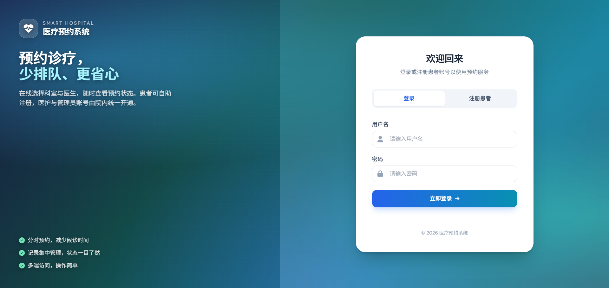
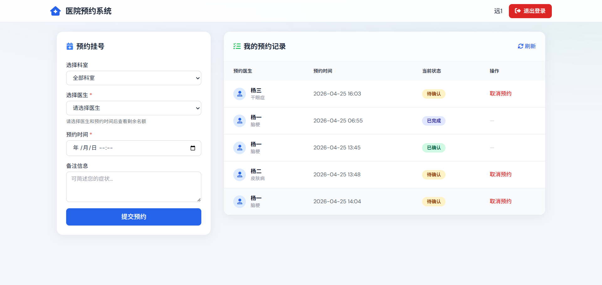
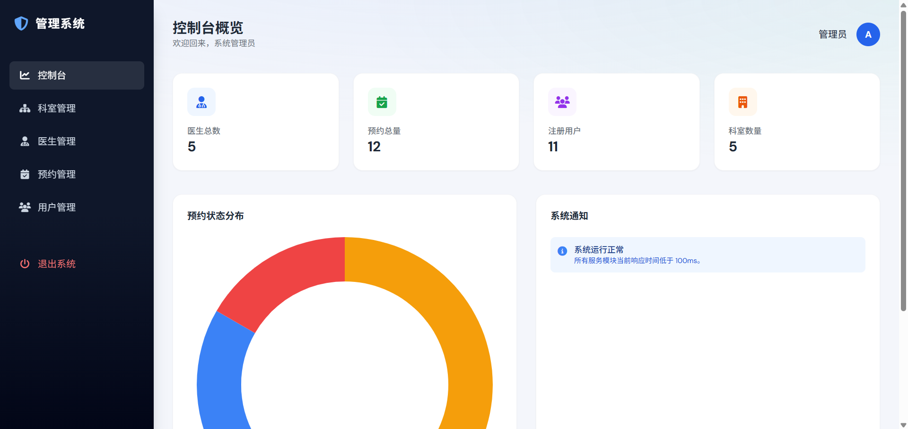

# 基于Spring Boot的医疗预约系统
本科毕业设计

## 项目简介
本项目是基于Spring Boot + MySQL开发的医疗预约系统，实现了用户注册登录、在线挂号、预约管理、医生管理、科室管理、后台管理等完整功能。系统界面简洁、结构清晰，适合毕业设计展示与使用。

## 技术栈
- 后端：Spring Boot
- 持久层：MyBatis / MyBatis-Plus
- 数据库：MySQL
- 前端：HTML + CSS + JavaScript
- 构建工具：Maven
- 开发工具：IDEA

## 功能模块
### 用户端
- 用户注册、登录
- 查看科室、医生信息
- 在线预约挂号
- 查看我的预约、取消预约

### 管理员端
- 医生信息管理
- 科室管理
- 预约记录管理
- 用户管理
- 数据统计/查询

## 项目截图

### 用户登录页面

### 用户注册页面
只可注册用户，注册医生和管理员无权限

### 预约挂号页面
医生每日有预约上限，到达今日上限后无法预约

### 管理员后台
各个管理模块都具有增删改查功能

## 运行环境
- JDK 1.8+
- MySQL 5.7 / 8.0
- Maven 3.6+
- IDEA / Eclipse

## 部署运行步骤
1. 创建数据库 `medical` 并执行SQL脚本
2. 修改 `application.yml` 中的数据库用户名和密码
3. 使用Maven导入依赖
4. 启动项目主类
5. 访问：http://localhost:8080

## 项目亮点
- 采用 MVC 分层架构，代码规范易读
- 完整实现预约挂号全流程
- 前后端交互流畅，功能无缺失
- 适合毕业设计、课程设计参考

---
作者：杨合明
